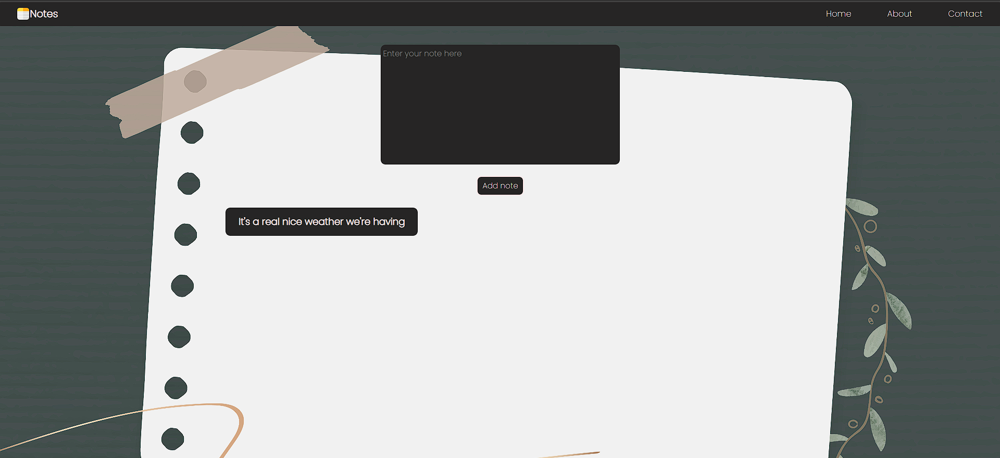

# Notes App

This is a simple notes app built with HTML, CSS, JavaScript, and Firebase. It allows users to create, read, update, and delete notes. The app uses Firebase Realtime Database for data storage.




## Features
- **CRUD Operations**: Users can create, read, update, and delete notes.
- **Realtime Updates**: Any changes made to notes are instantly synced across devices.
- **Responsive Design**: The app is responsive and works well on different screen sizes.

## Technologies Used

- HTML
- CSS
- JavaScript
- Firebase (Realtime Database)

## Installation

1. Clone the repository:

```bash
git clone https://github.com/your-username/notes-app.git
